# Домашнее задание к занятию «Введение в Terraform»

Исходный код проекта лежит в ["src/"](src/). Скриншоты - в ["screenshots/"](screenshots/).

## Чек-лист готовности

- Terraform установлен (версия нужна >= 1.12.0, у меня 1.16.x). Ставил через snap, потому что с apt-репозиторием HashiCorp получилась история с несовпадением GPG-ключа.
- Docker установлен, "docker ps" работает без sudo.
- Исходники из "ter-homeworks/01/src" скопированы в рабочий каталог.

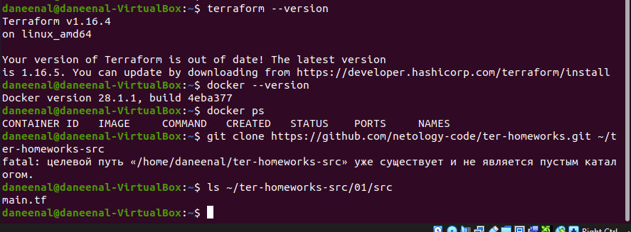

На первом скриншоте Terraform 1.16.4. Пока я делал задание, snap обновил его до 1.16.5 - это видно на следующем скриншоте и в "terraform.tfstate" дальше. Ничего не ломалось, просто чтобы не было вопроса «почему версии разные». Ещё на первом скриншоте видна ошибка "fatal" от "git clone": репозиторий "ter-homeworks" я склонировал заранее, поэтому повторный "clone" в уже существующий каталог ругнулся. На работу это не влияет.

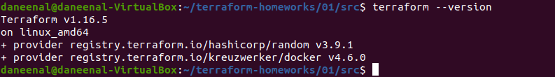

---

## Задание 1

### 1. Установка зависимостей ("terraform init")

Первый "terraform init" у меня упал сразу:

```
Error: Unsupported Terraform Core version
  on main.tf line 7, in terraform:
   7:   required_version = "~>1.12.0"
This configuration does not support Terraform version 1.16.4.
```

Причина: оператор "~>" в "~>1.12.0" разрешает только обновление последней цифры, то есть версии от 1.12.0 до 1.12.x. А у меня 1.16.x. В чек-листе при этом написано «версия >= 1.12.0», так что я поменял ограничение под текст задания, а не ставил старый Terraform:

```
required_version = ">= 1.12.0"
```

Ещё в "src" лежит файл ".terraformrc" - это настройка зеркала провайдеров Яндекса (с российских IP "registry.terraform.io" недоступен напрямую). Я скопировал его в домашний каталог ("cp .terraformrc ~/.terraformrc"), после этого "init" прошёл, провайдеры "kreuzwerker/docker" v4.6.0 и "hashicorp/random" v3.9.1 скачались через зеркало.

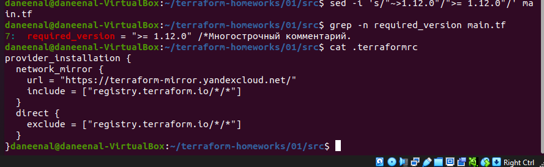

Вывод успешного "terraform init":

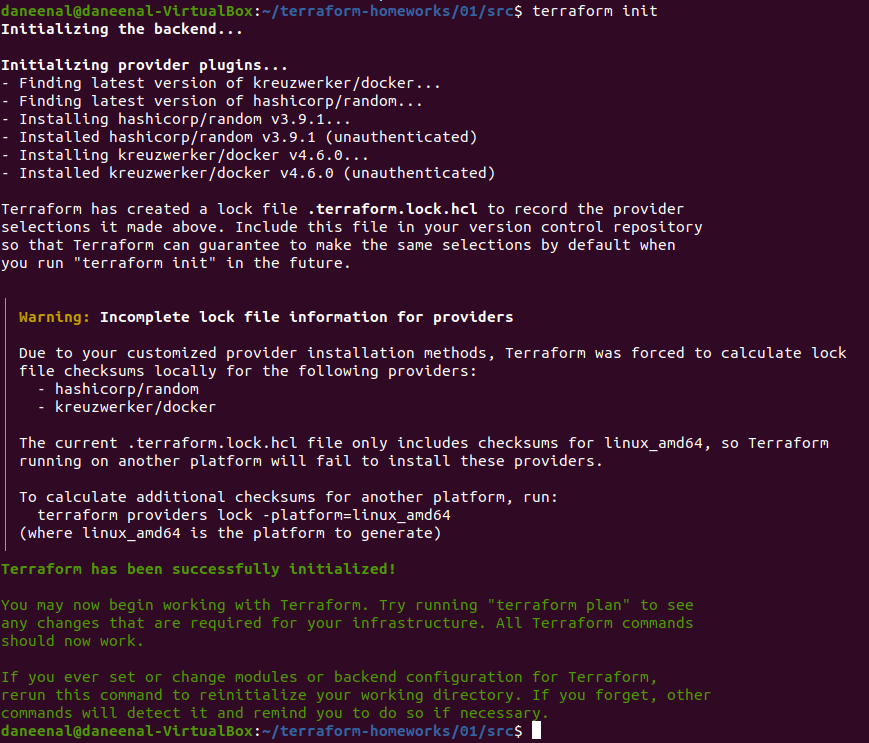

Предупреждение про lock-файл («Incomplete lock file information») - не ошибка, Terraform просто посчитал контрольные суммы только для моей платформы linux_amd64.

### 2. В каком файле можно хранить секреты

Смотрим ".gitignore":

```
# Local .terraform directories and files
**/.terraform/*
.terraform*

!.terraformrc

# .tfstate files
*.tfstate
*.tfstate.*

# own secret vars store.
personal.auto.tfvars
```

Личные секреты (логины, пароли, ключи, токены) можно хранить в **"personal.auto.tfvars"** - он прямо указан в ".gitignore" с комментарием «own secret vars store», значит в git не попадёт. Terraform подхватывает "*.auto.tfvars" автоматически, без флага "-var-file".

".tfstate" тоже в ".gitignore", но это не место для своих секретов, а файл состояния, где секреты оказываются сами (см. следующий пункт).

### 3. Секретное содержимое "random_password" в state

Скриншоты этого пункта и следующих я снимал со второго прогона с нуля (удалил state и прошёл всё заново), поэтому пароль в них другой, чем в моём первом прогоне. Внутри README все значения из одного прогона.

Сначала создал только ресурс "random_password" ("terraform apply -target=random_password.random_string", "yes" вручную). Ключ "-target" я использовал, чтобы пока не трогать остальное, Terraform предупреждает, что для обычной работы он не предназначен.

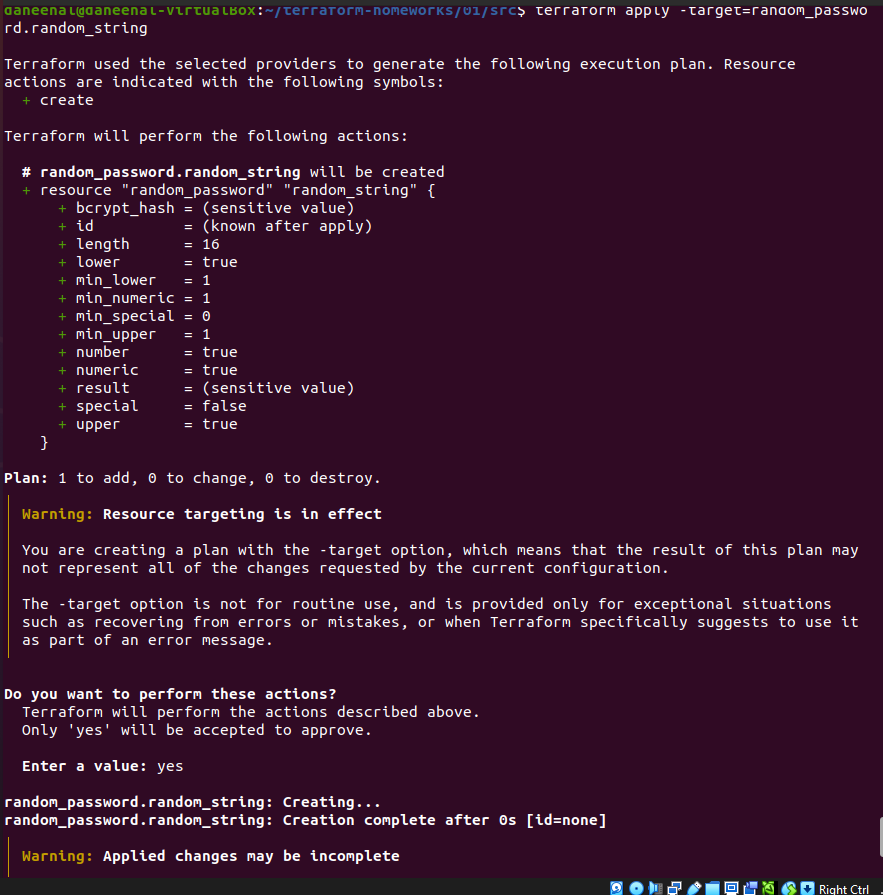

Потом нашёл значение в "terraform.tfstate":

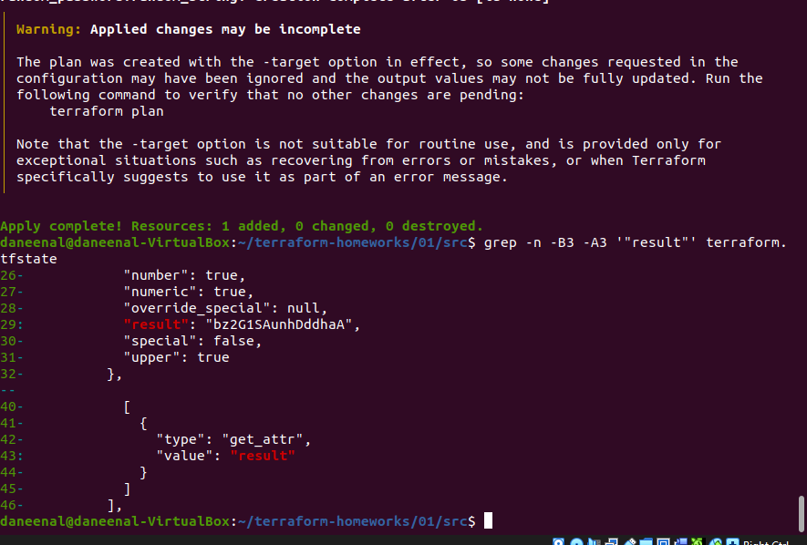

Ключ: "result", значение: **"bz2G1SAunhDddhaA"**.

В выводе "terraform plan/apply" это поле показано как "(sensitive value)", а в state-файле лежит открытым текстом. Поэтому state нельзя коммитить в git.

### 4. Ошибки в раскомментированном блоке ("terraform validate"), исправление

Раскомментировал блок в "main.tf" (убрал "/*" и "*/") и запустил "terraform validate". Ошибки Terraform показывает не все сразу, мне пришлось исправлять и прогонять валидацию трижды.

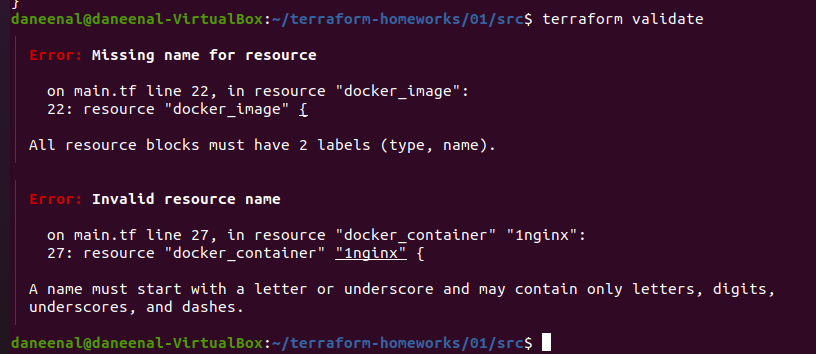

**Ошибка 1. "Missing name for resource":** "resource "docker_image" {" - у ресурса только тип, нет имени. У каждого "resource" должно быть два лейбла (тип и имя). Добавил имя "nginx", на него ссылается контейнер ("docker_image.nginx.image_id").

**Ошибка 2. "Invalid resource name":** "resource "docker_container" "1nginx"" - имя ресурса начинается с цифры. Имя должно начинаться с буквы или подчёркивания. Переименовал в "nginx".

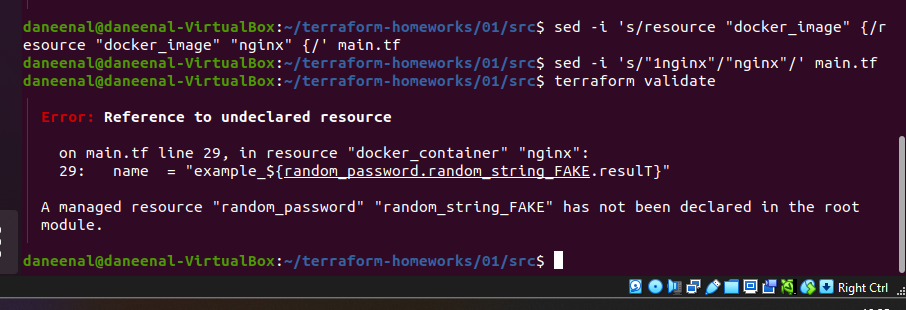

**Ошибка 3. "Reference to undeclared resource":** в имени контейнера было "random_password.random_string_FAKE.resulT". Тут два косяка:
- ресурса "random_string_FAKE" нет, объявлен "random_string";
- атрибут называется "result", а не "resulT" - Terraform чувствителен к регистру. Эту опечатку я бы увидел только после исправления первой, потому что Terraform остановился на несуществующем ресурсе.

Исправленный фрагмент:

```hcl
resource "docker_image" "nginx" {
  name         = "nginx:latest"
  keep_locally = true
}

resource "docker_container" "nginx" {
  image = docker_image.nginx.image_id
  name  = "example_${random_password.random_string.result}"

  ports {
    internal = 80
    external = 9090
  }
}
```

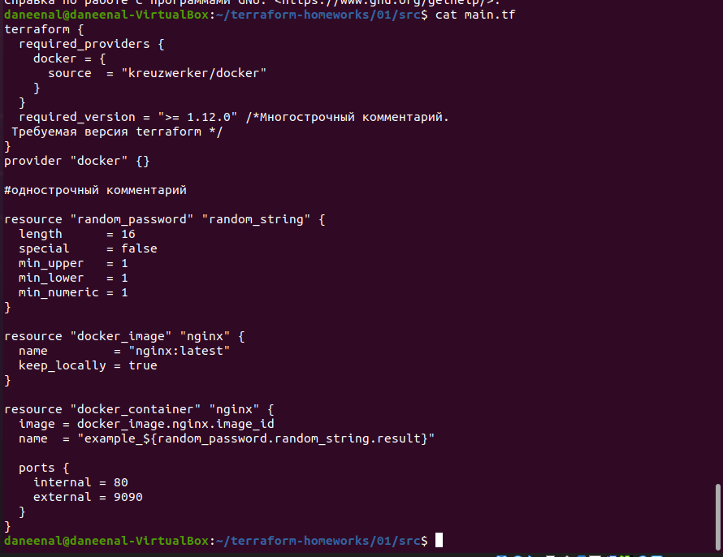

### 5. Выполнение исправленного кода и "docker ps"

После исправлений "terraform validate" проходит, "terraform apply" (с ручным "yes") создаёт 2 ресурса, пароль из первого шага уже был в state. План:

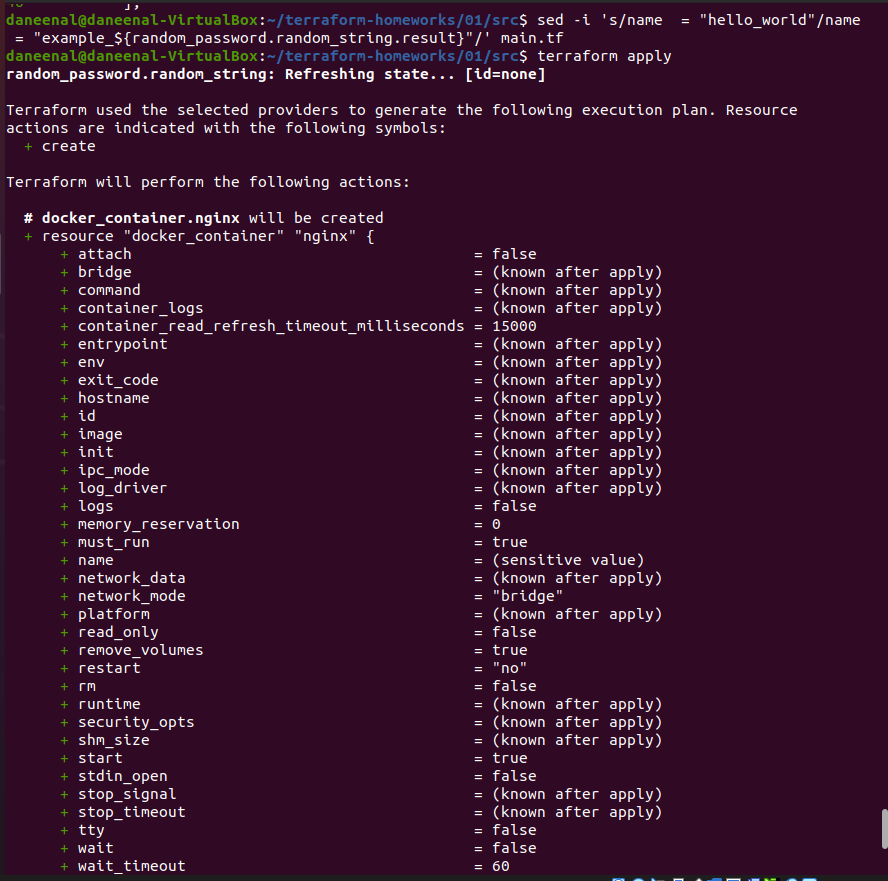

Результат "apply":

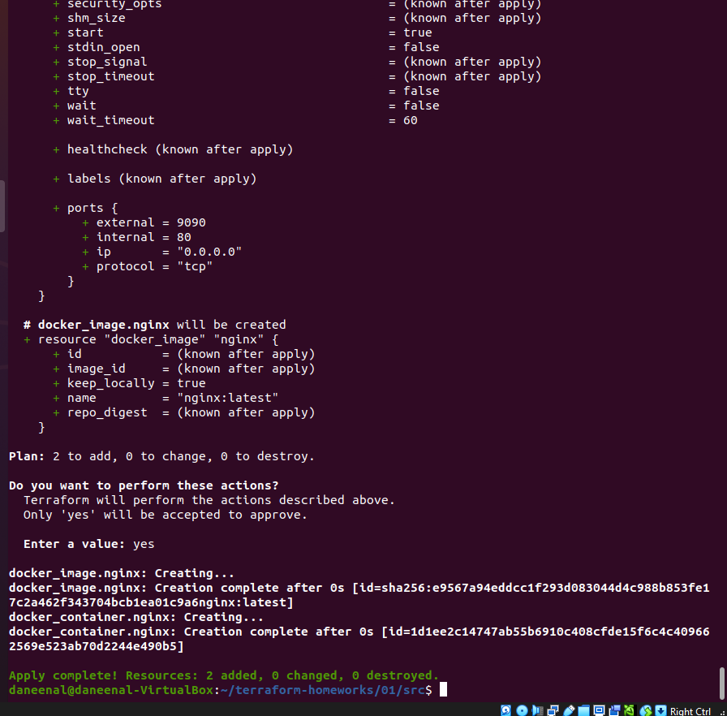

Вывод "docker ps":

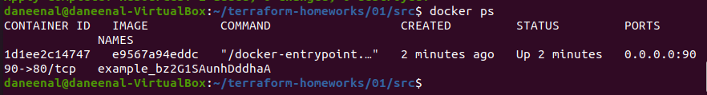

Контейнер называется "example_bz2G1SAunhDddhaA" - то есть пароль из "random_password" попал прямо в имя контейнера, и его видно в обычном "docker ps". В реальной жизни так секреты передавать не стоит.

### 6. Переименование в "hello_world" и "-auto-approve"

Поменял только имя контейнера (образ остался "name = "nginx:latest""):

```hcl
resource "docker_container" "nginx" {
  image = docker_image.nginx.image_id
  name  = "hello_world"
  ...
}
```

Проверил "grep", что имя поменялось только у контейнера, и применил с ключом "-auto-approve". Подтверждения не спросили, план просто пролетел и сразу выполнился:

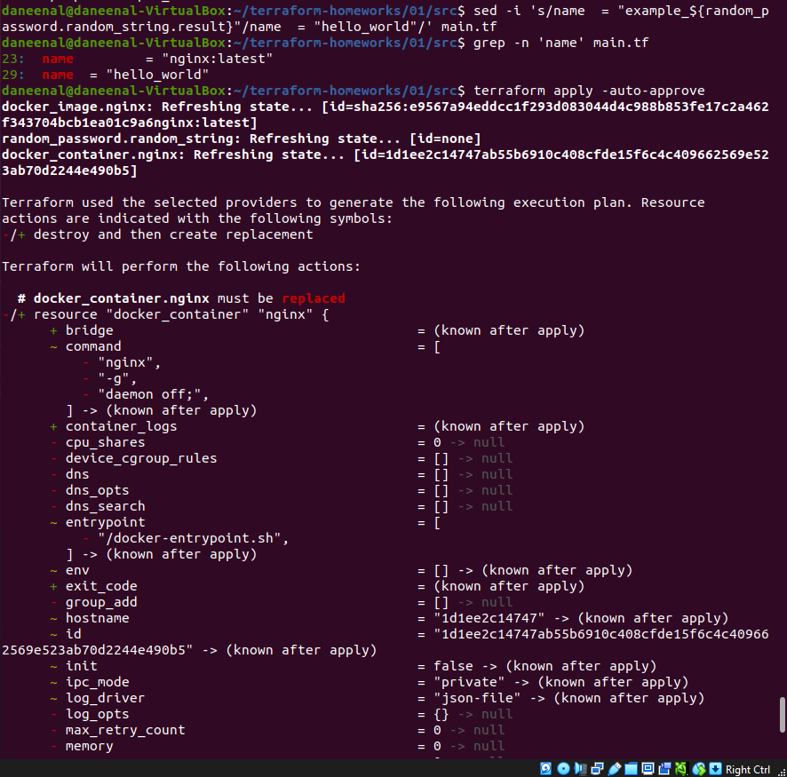

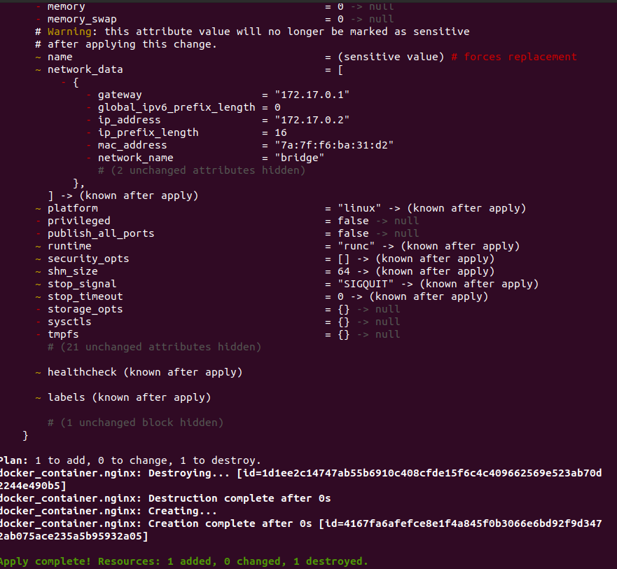

Вывод "docker ps" после замены:

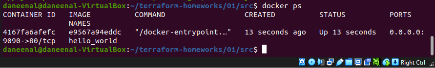

Docker не умеет переименовывать контейнер на лету через провайдер, поэтому Terraform его не изменил, а **пересоздал** ("-/+ destroy and then create replacement", "# forces replacement" у поля "name").

**Чем опасен "-auto-approve".** Ключ заставляет "terraform apply" выполнить план сразу, без показа плана и вопроса «Do you want to perform these actions?». То есть я не вижу, что именно Terraform сейчас сделает, и не могу остановить. На моём примере: я хотел «просто переименовать контейнер», а Terraform удалил старый и создал новый. С обычным "apply" я бы увидел "-/+ destroy and then create replacement" и мог бы подумать. Для контейнера с nginx это ерунда, но если бы так «заменялась» база данных или диск с данными, их бы просто не стало. Плюс опечатка в коде, не тот workspace/аккаунт или протухший state дали бы такой же результат без единого шанса отменить.

**Зачем он нужен.** В автоматизации, где некому нажимать "yes": CI/CD-пайплайны, скрипты, cron. Там "-auto-approve" обычно используют вместе с заранее сохранённым и проверенным планом ("terraform plan -out=tfplan", потом "terraform apply tfplan"), чтобы применялось ровно то, что уже кто-то посмотрел. Руками на реальной инфраструктуре я бы его не использовал.

### 7. Уничтожение ресурсов

"terraform destroy" с ручным подтверждением. Первый раз у меня вышло "Destroy cancelled": я вставил в терминал сразу несколько команд, и вместо слова "yes" в запрос подтверждения ушла следующая строка. Ничего не удалилось, повторил "destroy" отдельно и ввёл "yes" руками - "Destroy complete! Resources: 3 destroyed".

Дальше проверил, что всё удалено, и вывел "terraform.tfstate":

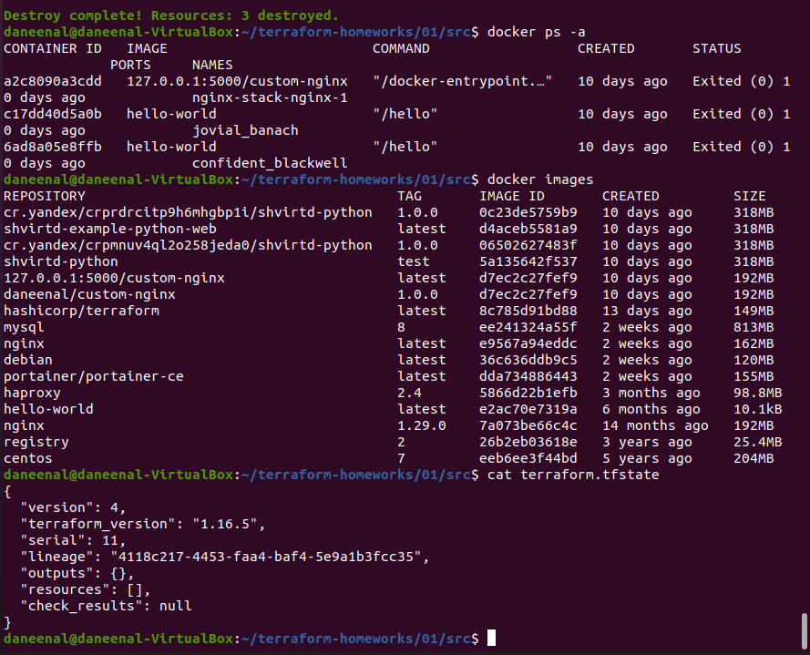

- "docker ps -a" - контейнера "hello_world" нет (остались только старые остановленные контейнеры из прошлых занятий, к Terraform они не относятся);
- "docker images" - образ "nginx:latest" на месте (см. следующий пункт);
- содержимое "terraform.tfstate":

```json
{
  "version": 4,
  "terraform_version": "1.16.5",
  "serial": 11,
  "lineage": "4118c217-4453-faa4-baf4-5e9a1b3fcc35",
  "outputs": {},
  "resources": [],
  "check_results": null
}
```

""resources": []" - Terraform больше ничем не управляет.

### 8. Почему не удалился образ "nginx:latest"

В коде у ресурса образа стоит "keep_locally = true":

```hcl
resource "docker_image" "nginx" {
  name         = "nginx:latest"
  keep_locally = true
}
```

Это же было видно в плане "destroy": "- keep_locally = true -> null". Документация провайдера "kreuzwerker/docker", ресурс "docker_image", аргумент "keep_locally":

> If true, then the Docker image won't be deleted on destroy operation. If this is false, it will delete the image from the docker local storage on destroy operation.

То есть "destroy" убрал ресурс из state ("resources: []"), но сам образ из локального хранилища Docker не трогал, потому что я (точнее, автор кода) сказал его оставить. Если поставить "keep_locally = false", образ удалится вместе с ресурсом.

---

## Задание 2*

Пока не выполнено.

## Задание 3*

Пока не выполнено.
